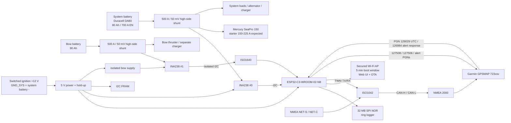
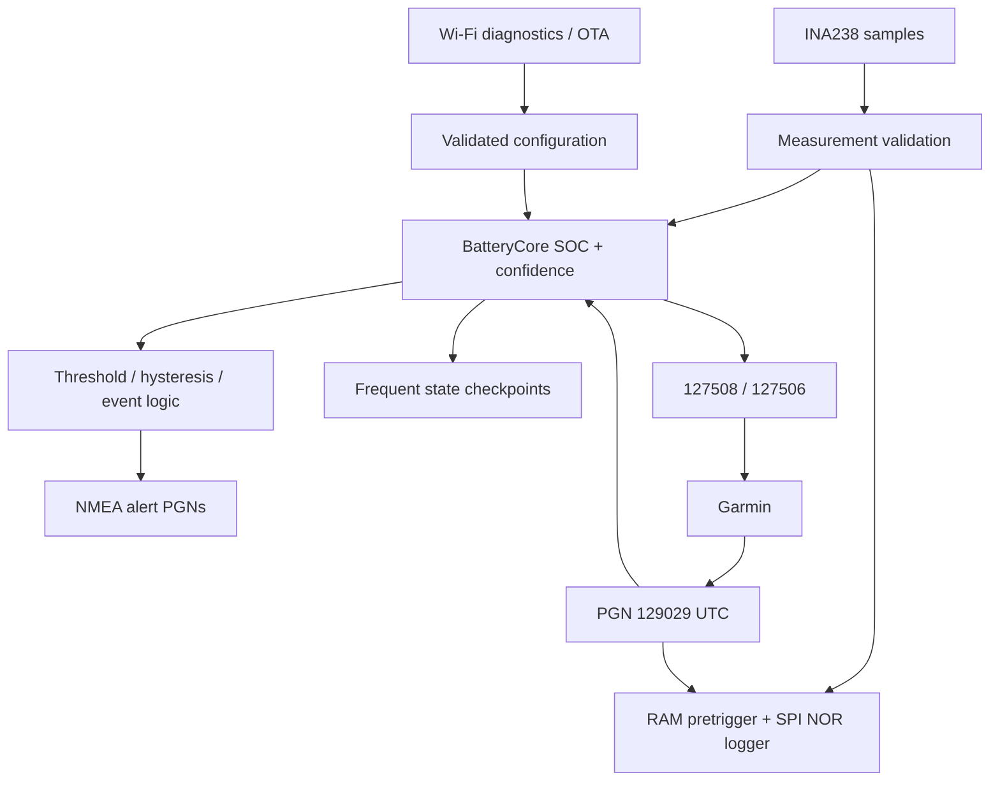

# V1 Architecture

## System overview

BatterySentinel N2K is one NMEA 2000 node which monitors two independent 12 V battery banks.



## Ground domains

Only the bow bank needs battery-domain isolation from the system electronics. NMEA remains separately isolated.

```text
GND_SYS  : system battery negative = ignition negative = ESP32 = INA238 #0
GND_BOW  : bow battery negative = INA238 #1 isolated domain
GND_N2K  : NMEA 2000 NET-C = ISO1042 bus side

GND_SYS || ISO1640 + isolated supply || GND_BOW
GND_SYS || ISO1042                   || GND_N2K
```

There is **no extra isolation between ignition ground and system-battery ground** because they are the same electrical node in the boat.

## High-side measurement

High-side is retained for installation robustness, not because the ADC is more accurate there.

```text
SYSTEM BATTERY +
   |
main fuse
   |
500 A / 50 mV shunt
   |
COMMON POSITIVE NODE
   |- Mercury starter / engine charging path
   |- system loads
   |- external charger
```

This avoids placing the shunt into the common negative/engine-ground path. A low-side design would only be valid if absolutely every system negative path were guaranteed to pass through the shunt.

Both V1 shunts are 500 A / 50 mV (100 micro-ohm). At the expected 225 A starter current the system shunt drops about 22.5 mV and dissipates about 5.1 W. The 700 A EN CCA figure is a battery capability rating and is not treated as the expected starter operating current.

## Battery instances

| Battery instance | Meaning | Capacity / chemistry |
|---:|---|---|
| 0 | System battery | Duracell Advanced DA80; 80 Ah; flooded lead-acid; 700 A EN |
| 1 | Bow-thruster battery | 90 Ah; exact chemistry/model still to confirm |

The GTIN supplied for the system battery (`9005753086036`) corresponds to DA80 / 80 Ah. This corrects the earlier 70 Ah assumption.

## NMEA 2000 model

V1 publishes:

- PGN 127508 — Battery Status for instances 0 and 1.
- PGN 127506 — DC Detailed Status / SOC when confidence is sufficient.
- NMEA alert family 126983 / 126985 / 126987 / 126988 for user-visible warnings.

Garmin GPSMAP 7x3 supports the battery/status traffic and receives the NMEA alert PGNs; it transmits alert response PGN 126984. It also supports PGN 129029 GNSS Position Data, which BatterySentinel uses as the preferred UTC source.

Settings such as capacity and thresholds are exposed through BatterySentinel's own browser UI rather than relying on a Garmin-specific custom configuration screen.

## SOC model and off-time

The monitor is intentionally powered only with ignition, so charge/discharge while off cannot be integrated directly.

```text
clean shutdown
   |
FRAM: SOC + consumed Ah + shutdown UTC
   |
IGN off
   |  no normal consumers
   |  possible self-discharge
   |  possible external charger (unknown Ah)
   |
next boot
   |
receive network UTC from PGN 129029
   |
calculate off duration
   |
apply tiny self-discharge estimate
   |
check voltage/current
   |- charger active -> no OCV correction
   |- true rest       -> slow OCV plausibility correction
   '- full condition  -> sync SOC to 100 %
```

The DA80 manufacturer sheet gives approximately 3 % self-discharge per month, so the expected natural loss over 2-5 days is only about 0.2-0.5 %. External charging is the larger unknown and is handled by SOC-confidence logic and later resynchronization rather than pretending it was measured.

## Sampling and logging

The acquisition path runs at **50 Hz** to capture starter and bow-thruster transients.

```text
INA238 samples @ 50 Hz
        |
        +--> BatteryCore SOC / alarms
        |
        +--> RAM pre-trigger ring (10 s)
        |
        +--> 1 Hz long-term record --> 32 MB SPI NOR circular log
        |
        '--> event trigger --> save 10 s before + 30 s after @ 50 Hz
```

Normal long-term target is 2-5 days, while event logs keep high-rate detail around starter, thruster and fault events. CSV export and plots are provided by the local web UI.

## Startup diagnostics and OTA

On every boot BatterySentinel automatically creates a secured Wi-Fi AP for five minutes.

- If nobody connects in five minutes, Wi-Fi is shut down.
- If a client connects, diagnostics remain available while connected.
- After the last client leaves, a short grace period expires and Wi-Fi is shut down.
- Browser UI exposes live values, raw sensor diagnostics, configuration, logs and OTA update.
- Use ESP32-C3-WROOM-02-N8 (8 MB) to provide comfortable A/B OTA partition space.

## Power-loss behavior

The switched ignition feed is monitored separately from the hold-up rail.

```text
IGN disappears
      |
GPIO power-loss edge
      |
      +--> Wi-Fi off
      +--> stop new config/OTA activity
      +--> finalize event/log record
      +--> checkpoint both battery states + UTC + CRC to FRAM
      +--> mark clean shutdown
      '--> wait for hold-up rail to collapse
```

A 0.22 F class supercap is charged through an inrush-limiting resistor and ORed into the hold-up rail with a diode. The design target is several seconds of electrical margin; the actual critical writes should finish in far less than one second.

## Data path



The same `BatteryCore` code remains shared by firmware, native unit tests and the desktop simulator.
