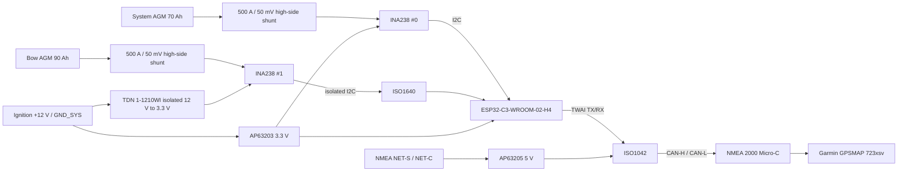
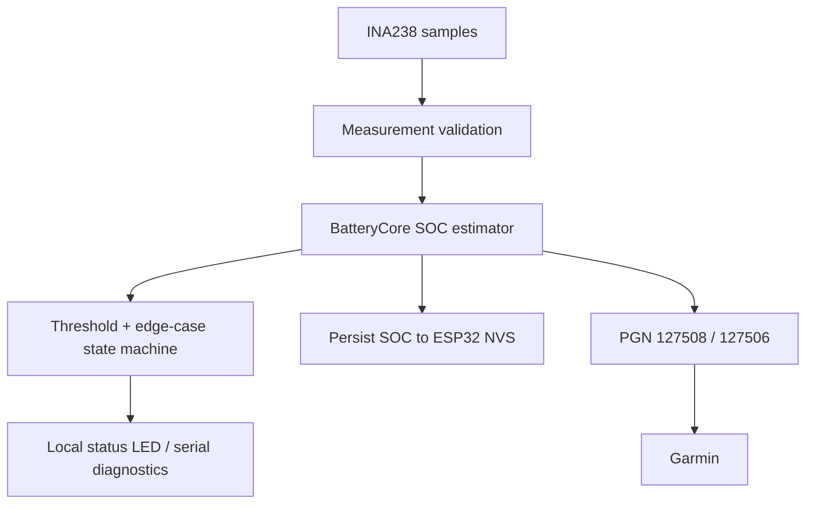

# V1 Architecture

## System overview

BatterySentinel N2K is one NMEA 2000 node which monitors two electrically independent 12 V AGM battery banks.



## Ground domains

Never join these three grounds on the PCB:

```text
GND_SYS  : System battery negative, ignition negative, ESP32, INA238 #0
GND_BOW  : Bow battery negative, INA238 #1, isolated side of ISO1640
GND_N2K  : NMEA 2000 NET-C, isolated CAN bus side

GND_SYS || ISO1640 || GND_BOW
GND_SYS || ISO1042 || GND_N2K
```

The bow-domain isolated DC/DC provides power isolation; ISO1640 provides signal isolation. The NMEA bus side is powered from NET-S/NET-C, so the ISO1042 barrier remains meaningful without another isolated NMEA DC/DC converter.

## High-side current measurement

Both battery banks use identical 500 A / 50 mV shunts (100 micro-ohm):

```text
BATTERY +
   |
[main battery fuse]
   |
   +------ INA238 IN-  (battery side Kelvin)
   |
[500 A / 50 mV SHUNT]
   |
   +------ INA238 IN+  (load/charger side Kelvin)
   |
   +------ all loads
   +------ all chargers
```

This orientation gives the firmware convention:

- charge: load/charger side is slightly above battery side -> positive measured current
- discharge: load/charger side is slightly below battery side -> negative measured current

At 200 A, a 100 micro-ohm shunt drops 20 mV and dissipates 4 W. At 500 A it drops 50 mV and dissipates 25 W. Shunts therefore remain outside the sealed electronics enclosure and receive ventilated insulating covers.

## NMEA 2000 model

One physical NMEA source address publishes two logical battery instances:

| Battery instance | Meaning | Capacity |
|---:|---|---:|
| 0 | System battery | 70 Ah |
| 1 | Bow-thruster battery | 90 Ah |

V1 sends:

- PGN 127508 — Battery Status: voltage, current, battery instance; temperature unavailable.
- PGN 127506 — DC Detailed Status: SOC and time remaining when available.

V1 does not pretend to know State of Health or battery temperature. Those fields are sent as NMEA `Not Available`.

The device is an unregistered DIY NMEA 2000 node. It uses manufacturer code 2046 as a development placeholder and must not be represented as NMEA-certified.

## Power states

The product is intentionally not always-on.

- `IGN OFF`: main ESP32/system measurement domain off.
- `IGN ON`: firmware, both measurement channels and NMEA publisher are active.
- NMEA bus-side ISO1042 supply exists only while NET-S is powered.

There is no requirement to reach microamp sleep current in V1.

## Direct programming

V1 reserves ESP32-C3 native USB pins:

- GPIO18 = USB D-
- GPIO19 = USB D+

The final PCB shall provide USB-C with 5.1 kOhm CC pull-downs, USB ESD protection and a power arrangement that allows bench programming without accidentally back-powering the boat ignition circuit.

## Data path



The same `BatteryCore` source is linked into firmware, native unit tests and the desktop simulator.
