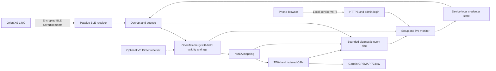

# Orion XS 1400 to NMEA 2000 bridge investigation

Last updated: 2026-09-19

Status: bridge firmware implemented and build-tested; Orion XS 1400, GPSMAP 723xsv and installed NMEA hardware interoperability remain untested.

## Implemented dongle firmware (2026-09-19)

Build and flash `pio run -e orion_dongle` and `pio run -e orion_dongle -t upload`. This is a separate 4 MB ESP32-C3 image; the existing `esp32c3` battery-monitor image remains separate and retains its 8 MB partition layout. Do not flash the 4 MB image onto the original board without checking the board's partition and power design. Source files: `src/dongle_main.cpp`, `src/OrionBleReceiver.*`, `lib/OrionBridge/src/OrionFrame.h`, `src/NmeaPublisher.*`, `src/BridgeSettings.*`, and `src/BridgePortal.*`.

The bridge passively scans encrypted Victron manufacturer advertisements for the configured MAC and Orion XS product ID `0xA3F1`/record type `0x0F`. It decrypts with the Instant Readout key, decodes voltage/current, state, error and off reason, and rejects implausible or truncated frames. It does not open a GATT connection, pair, send a PIN, control the charger, read shunts, estimate SOC, or generate BatterySentinel alarms. The VictronConnect PIN is **not** entered here: use VictronConnect on the phone to obtain the Instant Readout encryption key and Bluetooth MAC from the charger's product information, then enter those into the dongle's web interface. A PIN change may require a fresh key. The key is stored only on the device in ESP32 NVS, not in this repository. NVS is **not encrypted** in this prototype, so physical flash extraction remains a risk.

The firmware sends PGN 127508 for output and input values every second and PGN 127506 to label output as Battery and input as Converter every five seconds. It maps only known Bulk/Absorption/Float states to 127507. The default data instances are output 0 and input 1, configurable and required to differ. Output/input power is derived locally for the browser; there is no fabricated SOC, battery temperature or NMEA alarm. After ten seconds without a frame, transmitted voltages/currents become NMEA unavailable and the browser marks data stale. The bridge does not send DC values until an Orion identity/key is configured.

The phone portal uses a local WPA2 access point and HTTPS with a self-signed, device-generated certificate. On first boot the access-point password is generated at random, stored in NVS, and printed to the native USB serial console at 115200 baud. Until the first administrator is created, it is printed on every boot. To print it again through the physical USB recovery channel, connect USB serial and hold BOOT for two seconds after normal boot, even when the setup AP is already open (holding it during reset can enter the ROM bootloader). Its SSID is `OrionBridge-XXXXXX`; open `https://192.168.4.1/` on a connected phone. Accept the self-signed certificate warning only while directly connected to the expected dongle AP. Hold the board's BOOT button while submitting the first administrator username (3–32 alphanumeric/underscore/hyphen characters) and password (12–128 characters). Later, hold BOOT for two seconds to open the portal; it closes after five minutes without a Wi-Fi client. Sign in to configure the Orion MAC, 32-hex-character advertisement key and NMEA instances, or to forget the Orion. Changes restart the board. The HTTPS session is short-lived, with Secure/HttpOnly/SameSite cookies and CSRF protection for form changes. Passwords are PBKDF2-SHA256 salted hashes. The live page shows decoded values, derived watts, state/error/off reason, age, RSSI, receive/reject and NMEA-send counts, plus a bounded 64-event BLE/NMEA timeline. Neither the password nor Orion key is returned by the API. There is no OTA handler in this dongle portal yet; use USB flashing. Lost admin credentials require erasing NVS and recommissioning.

**ESP32-C3 SuperMini feasibility:** yes for a prototype, conditional on the exact board variant. A typical ESP32-C3FN4 SuperMini has 4 MB flash and exposes GPIO6/7 (used here for TWAI TX/RX), GPIO9 BOOT, native USB and 5 V input. The 4 MB dual-slot image builds at **1,659,814 of 1,966,080 bytes per app slot (84.4%)** and static RAM is **66,468 of 327,680 bytes (20.3%)** with PlatformIO Espressif32 6.11.0 / Arduino-ESP32 2.0.17 / NMEA2000 4.24.1. This is compile-time size, not proof of sufficient runtime heap with simultaneous BLE/Wi-Fi/HTTPS. GPIO6/7 must drive a suitable **isolated NMEA 2000 CAN transceiver**, not the bus directly; provide protected 12 V-to-5 V power, isolation-side supply, Micro-C wiring and installation protection. Verify the exact SuperMini board's 5 V/USB power arrangement before connecting both, and never apply 12 V to the module. The common SuperMini has GPIO8 tied to an LED and GPIO9 to BOOT; board variants and power circuits differ. [NuttX SuperMini board documentation](https://nuttx.incubator.apache.org/docs/latest/platforms/risc-v/esp32c3/boards/esp32c3-supermini/index.html), [SuperMini board datasheet](https://dl.artronshop.co.th/ESP32-C3%20SuperMini%20datasheet.pdf), [Espressif HTTPS server resource note](https://docs.espressif.com/projects/esp-idf/en/stable/esp32c3/api-reference/protocols/esp_https_server.html).

Validation completed: `pio run -e orion_dongle`, `pio run -e esp32c3` (after bridge changes), and `pio test -e native` (39/39 tests, including new XS field/sentinel/freshness tests). Still required before live use: verify the real 1400 advert PID/record/scales against VictronConnect, test BLE/Wi-Fi coexistence and available heap, inspect raw NMEA traffic for correct instances/NA behaviour, and confirm Garmin 723xsv display and CAN isolation on physical hardware. The synthetic decoder tests do not prove the BLE decryption against a real packet. This firmware is a functional prototype, not a completed boat acceptance test.

## Portal design and guided installation

The bilingual portal defaults to German and offers English through a language selector on every HTML page. It includes an embedded SVG identity and icons, a dark marine background, responsive navigation, and Overview, Setup, Guide and Monitor screens. All assets are served from firmware; the phone needs no Internet connection, external fonts or CDN. The editable wordmark is in `assets/battery-sentinel-orion-logo.svg`, and the page assets are in `src/BridgePortalUi.h`.

The language preference is stored in the browser (`bridgeLanguage` in local storage, with guarded session-storage fallback), not in device NVS. It survives page loads and normal browser restarts when persistent storage is available. New browsers and unsupported stored values use German. If storage is blocked, language switching still works for the current page. Switching updates labels, help, guide steps, validation, errors, statuses and retained diagnostic messages in place, without clearing inputs, changing protocol data, or restarting the device. English source strings and documentation remain canonical; the German catalogue lives in `src/BridgePortalTranslations.h`, and `src/BridgePortalLanguage.h` contains the controller.

First use starts with administrator enrollment. Once signed in, an unconfigured bridge opens the four-step guide: local access and Wi-Fi password recovery, Orion Instant Readout details in VictronConnect, input/output NMEA instance mapping, and verification on the charger/network/display. The guide remains accessible from the menu, remembers progress within the browser session, and resumes at verification after saving configuration and restarting. Restricted browser storage does not prevent navigation or monitoring.

The setup form validates MAC/key format and distinct instance numbers, explains why the Bluetooth PIN is not entered, and clearly requests re-entry of the readout key on every save. Narrow screens use one column for setup fields. The live monitor uses one non-overlapping request per update, bounds stalled requests to 12 seconds, hides live values on connection loss, and offers sign-in when the session expires. Events are displayed as separate lines. Administrator password verification still takes approximately ten seconds on the C3; the submit button indicates that work is in progress.

UI verification: firmware build and COM8 upload passed; all 39 native tests passed. Five page variants passed static HTML balance checks, and inline JavaScript passed syntax checks. A Node test with a simulated DOM exercised navigation, storage denial, guide resume, instance validation, event line breaks, offline values, session expiry, request timeout and non-overlapping polling. These checks do not establish rendered appearance or mobile browser compatibility. The in-app browser blocked the local preview URL, so visual review of the final layout on the physical phone remains open.

## Recommendation

Implement a separate, read-only **Orion Bridge** mode using passive Bluetooth LE Instant Readout. Reuse the ESP32-C3 and NMEA transport, but bypass the battery estimator and alarm engine entirely. Commission the Orion address and advertisement key through the existing phone-accessible web-portal concept.

Publish input and output voltage/current as distinct NMEA sources. Probe charger-state display on the actual GPSMAP 723xsv before promising it. Preserve all decoded fields in the local phone UI; the Garmin cannot yet be promised to display every Orion value.

Prefer **VE.Direct Text** if a wire is acceptable and reception reliability matters more than wireless installation. If a suitable GX device already exists, evaluate its official Orion NMEA2000-out first: support was added in Venus OS 3.70. [Victron release announcement](https://www.victronenergy.com/blog/2026/2/25/introducing-venus-os-3-70/)

## Scope and requirements

- Add an operating mode that receives Victron Orion XS 1400 telemetry over Bluetooth and translates it to NMEA 2000 for a Garmin chartplotter.
- This mode is a telemetry dongle: no BatterySentinel alarms, battery-state estimation, or charger control.
- Configure device credentials at commissioning from a phone; never commit credentials to the repository or embed them in firmware defaults.
- Allow an operator to connect to the dongle using a separate username and password.
- Provide a phone-friendly web interface for setup and a live diagnostic monitor of received Orion data and transmitted NMEA messages.
- Investigate alternative Orion interfaces as well as Bluetooth.
- Keep software and documentation in English.
- Maintain this document as the durable decision and open-issue record.

## Initial repository findings

Baseline: `main`, commit `e054463`; working tree clean before this investigation.

- Firmware targets ESP32-C3 with Arduino/PlatformIO and an 8 MB flash layout.
- `src/main.cpp` currently initializes INA238 sensors, BatteryCore SOC/alarm processing, NVS SOC persistence, the diagnostics portal, and the NMEA publisher unconditionally for the primary battery.
- `src/NmeaPublisher.cpp` currently publishes PGN 127508 and 127506 using BatterySnapshot. It does not implement NMEA alert PGNs despite the broader roadmap in `docs/architecture.md`.
- `src/SettingsStore.*` already provides runtime settings in ESP32 NVS.
- The user confirmed Garmin GPSMAP 723xsv and wants as many available Orion values as possible.
- `DiagnosticsPortal` is coupled to two BatteryCore instances. Its current AP password is derived from the MAC address and printed to serial; it needs a commissioning design suitable for transferring a device secret.
- All existing portal routes, including `/api/live`, `/save`, and `/update`, are currently accessible to anyone who joins its AP. There is no application login, access control, or live frame/message timeline.
- `Nmea2000Twai` already provides the 250 kbit/s CAN transport. No Bluetooth receiver or BLE dependency exists yet.
- The portal already uploads firmware into an A/B partition layout, but the documented healthy-boot rollback workflow is not visibly implemented. FRAM integration, ignition-loss handling and the external logger are also not wired into the main application. Treat those as original-monitor roadmap items, not bridge prerequisites.

## Research workstreams

- [x] Verify documented Orion XS 1400 Instant Readout support, fields and credential workflow; identify exact-packet validation gate.
- [x] Verify wired VE.Direct and GX alternatives.
- [x] Verify Garmin receive PGNs and distinguish protocol reception from actual gauge support.
- [x] Define truthful telemetry mapping, including unavailable values and stale data.
- [x] Define mode isolation, phone provisioning, hardware changes, and staged acceptance tests.
- [x] Consolidate sources, decisions, and implementation gates.

## Verified Orion interfaces

The 1400-specific manual explicitly supports encrypted Instant Readout. Its Product information page exposes the address and encryption key. This establishes model support without assuming that all Orion products use the same interfaces. [Orion XS 1400 operation manual, sections 4.5.7 and 4.5.13](https://www.victronenergy.com/media/pg/Orion_XS_1400_DC-DC_Battery_Charger/en/operation%2C-configuration-and-monitoring.html)

### Bluetooth Instant Readout

Victron publishes advertising as a third-party integration route. It avoids a permanent GATT connection and requires the device-specific advertisement key. [Victron protocol announcement](https://communityarchive.victronenergy.com/questions/187303/victron-bluetooth-advertising-protocol.html)

The documented Orion XS data set contains device state, input/output voltage and current, off reason and error code. SOC, capacity, time-to-go and battery temperature are not listed. [Victron GlobalLink supported data](https://www.victronenergy.com/media/pg/GlobalLink_520/en/product-compatibility---data-transmission-to-vrm.html)

Candidate decoder contract, from a Victron staff post about the older XS 12/12-50A:

| Bit offset in decrypted payload | Bits | Field | Encoding / unavailable value |
| ---: | ---: | --- | --- |
| 0 | 8 | Device state | Enumeration |
| 8 | 8 | Error code | Enumeration |
| 16 | 16 | Output voltage | Signed, 0.01 V; `0x7FFF` |
| 32 | 16 | Output current | Signed, 0.1 A; `0x7FFF` |
| 48 | 16 | Input voltage | Unsigned, 0.01 V; `0xFFFF` |
| 64 | 16 | Input current | Unsigned, 0.1 A; `0xFFFF` |
| 80 | 32 | Off reason | Bitmask |
| 112 | 16 | Reserved | Do not interpret |

The reported extra-record type is `0x0F`. The staff table has apparent unit/range typos for current; verify the amperes scaling against measured data. This layout predates the 1400, so reuse is an explicit hypothesis until an actual XS 1400 packet confirms it. Do not confuse it with the older generic DC/DC-converter record. [Victron staff layout and record-type discussion](https://community.victronenergy.com/t/orion-xs-12v-12v-50a-bluetooth-advertising-data/2183)

The outer product-advertisement type is `0x10`; it is distinct from the extra-record type. The extra record header includes a two-byte little-endian nonce/data counter and the first key byte. The published scheme uses AES-CTR. Validate the full nonce/counter construction against a known vector before connecting the decoder to NMEA output. Handle unavailable sentinels before scaling and permit documented record extensions while rejecting truncation. A matching first key byte is only a quick mismatch check, not authentication of the full key or message. PIN changes can change the advertisement key, requiring reprovisioning. [Victron extra manufacturer data specification](https://communityarchive.victronenergy.com/storage/attachments/extra-manufacturer-data-2022-12-14.pdf)

Unverified on this hardware: exact 1400 record/PID combination, broadcast cadence and range, and advertisement continuity while VictronConnect is actively connected. Passive reception does not occupy a GATT connection, but that alone does not prove uninterrupted advertisements during phone use.

### VE.Direct Text and HEX

VE.Direct Text is the preferred wired input for a small bridge: 19200 baud, 8N1, no flow control, approximately one-second blocks with a modulo-256 checksum. Connect only the receive path for physically read-only acquisition. The documented XS 1400 product ID is `0xA3F1`.

| Text label | Meaning | Scale |
| --- | --- | --- |
| `V`, `I`, `P` | Output voltage, current, power | mV, mA, W |
| `DC_IN_V`, `DC_IN_I`, `DC_IN_P` | Input voltage, current, power | 0.01 V, 0.1 A, W |
| `CS`, `ERR`, `OR` | State, error, off reason | Enumerations / bitmask |

The different input/output scales are a parser trap. Validate and commit complete checksum-correct blocks, with field availability, rather than publishing partially received lines. [VE.Direct Protocol 3.34](https://www.victronenergy.com/upload/documents/VE.Direct-Protocol-3.34.pdf)

Orion-specific HEX provides additional registers such as internal charger temperature and history. Input V/I/P registers are `0xEDBB`/`0xEDBD`/`0xEDBC`; output V/I/P are `0xED8D`/`0xED8F`/`0xED8E`; charger temperature is `0xEDDB`. If required, allowlist GET requests only. Orion Text output continues and is interleaved with HEX responses, so a combined parser must demultiplex them. [Orion XS HEX protocol](https://www.victronenergy.com/upload/documents/Orion-XS-HEX-protocol.pdf)

VE.Direct is not CAN or RS232 electrical signalling. Design the UART level interface and isolation from the electrical specification; never wire it directly to CAN. Victron recommends isolation, and the port's power pin is rated only 10 mA average, insufficient to power this ESP32. A VE.Direct-to-USB cable needs a USB host; the existing ESP32-C3 USB Serial/JTAG connector is not that host. [VE.Direct FAQ](https://www.victronenergy.com/live/vedirect_protocol%3Afaq)

### Other extraction paths

| Path | Assessment for this project |
| --- | --- |
| Passive BLE → Sentinel → NMEA | Best match to the requested wireless dongle; runtime key required; limited broadcast field set. |
| VE.Direct Text → Sentinel UART → NMEA | Recommended wired fallback; no key; continuous local data and direct power fields. |
| VE.Direct Text/HEX → Sentinel → NMEA | More fields/history, more parser work; GET requests still require a transmit connection. |
| VE.Direct → GX → VE.Can/NMEA 2000 | Official alternative, potentially removing the need for Sentinel when GX is already installed. |
| VE.Direct → GX → local Modbus-TCP/MQTT → bridge | Possible extra network hop; native GX NMEA output is normally simpler. |
| Direct BLE GATT using the PIN | No verified public Orion XS 1400 GATT contract found; unsuitable as the baseline. |
| VE.Smart Networking | Remote sensing for charge optimization, not the selected third-party telemetry export. |
| Orion directly to CAN/NMEA/Ethernet | No such native interface documented for the 1400; a gateway is required. |
| Old VE.Direct-to-NMEA2000/VE.Can adapter | Not a generic Orion adapter; legacy BMV support must not be mistaken for XS compatibility. |

The model specification lists Bluetooth, VE.Smart Networking and VE.Direct. [Orion XS 1400 technical data](https://www.victronenergy.com/media/pg/Orion_XS_1400_DC-DC_Battery_Charger/en/technical-data.html) The older public GATT announcement concerns SmartShunt and is not evidence of an Orion contract. [Victron GATT announcement](https://communityarchive.victronenergy.com/questions/93919/victron-bluetooth-ble-protocol-publication.html)

GX route: Orion VE.Direct → supported GX with Venus OS 3.70 or later → correctly configured 250 kbit/s VE.Can/NMEA port and Micro-C interface → Garmin. NMEA2000-out must be enabled. The GX documentation explicitly supports Orion XS; defaults are output instance 0/type Battery and input instance 1/type Converter. This is also a useful mapping reference for Sentinel. [GX NMEA integration](https://www.victronenergy.com/media/pg/Ekrano_GX/en/marine-mfd-integration-by-nmea-2000.html)

GX is not inherently the same restricted read-only/no-alert appliance proposed here: current features include control and alarm forwarding. Verify its configuration against that requirement. USB-based Orion acquisition belongs on the GX host. Legacy adapter limitations are documented in the [GX connection manual](https://www.victronenergy.com/media/pg/Cerbo_GX/en/connecting-victron-products.html) and [Marine Integration Guide](https://www.victronenergy.com/live/ve.can%3Anmea-2000%3Astart).

If needed, local GX extraction is documented through [Modbus-TCP](https://www.victronenergy.com/live/ccgx%3Amodbustcp_faq) and the [Victron MQTT bridge](https://github.com/victronenergy/dbus-flashmq/blob/master/README.md). Exact Orion field exposure must be checked for the chosen GX version. A cloud/VRM round-trip is unnecessary for live onboard telemetry.

## NMEA mapping and Garmin display limits

The GPSMAP 7x3 installation manual lists reception of PGNs 127506 and 127507, and transmit/receive support for 127508. This is protocol-level evidence, not proof of a particular screen or every field. [Garmin model-family PGN list](https://www8.garmin.com/manuals/webhelp/GUID-BF2FF273-008A-482A-A96F-362ADA8996BA/EN-US/GUID-0C4B3FAB-3E41-438C-B31E-9B5489790913.html)

| Orion information | Proposed output | Display expectation / limit |
| --- | --- | --- |
| Output voltage and current | PGN 127508, output data instance | Primary target; label `Orion Output`. Charger contribution, not whole-battery current. |
| Input voltage and current | PGN 127508, separate input data instance | Primary target; label `Orion Input`. Charger consumption, not total alternator/starter-battery current. |
| DC source classification | PGN 127506, matching instances and DC types | Follow the GX baseline first; SOC/SOH/time/capacity/ripple unavailable. |
| Bulk / absorption / float / equalization | Candidate PGN 127507, explicit state translation | Garmin receives it; charge-stage UI remains an acceptance gate. |
| Storage / external control / unknown state | Preserve exact state locally; conservative NMEA mapping or unavailable | No fabricated equivalent; no raw integer cast between enum families. |
| Input/output power and efficiency | Calculate locally from fresh V/I; wired power can be retained directly | No verified dedicated DC-watts mapping to the Garmin UI in this investigation. Test any Garmin-calculated watts. |
| Error code / off reason | Local status page | No generated NMEA alerts or encoded fake gauge values. |
| History, limits, RSSI, data age | Local UI if the selected input provides them | No verified standard Garmin display path. BLE record does not carry history/limits. |
| Internal charger temperature from HEX | Local value explicitly labelled charger temperature | Never place it in the battery-temperature field of 127508. |
| SOC, battery health, capacity, time-to-go | Unavailable | The Orion alone cannot replace a battery shunt/monitor. |

For example, 30 A Orion output with 10 A of simultaneous battery loads gives only 20 A net battery charge, before considering other sources. Neither net current nor SOC can be recovered from the Orion output alone. Its terminal voltages can also differ from remote battery-terminal voltages because of cable drop. Never present these readings as the shunt's measurements or combine their fields into a fictitious whole-battery measurement.

The upstream library describes 127508 as DC-source data with source type identified through 127506. Therefore, retain a metadata-only 127506 path even though the bridge has no SOC. The current `publishDc()` incorrectly requires initialized SOC for this new use case. Upstream also marks 127507 deprecated; treat it as a Garmin compatibility candidate, not a universal future-facing interface. [NMEA2000 message definitions](https://raw.githubusercontent.com/ttlappalainen/NMEA2000/master/src/N2kMessages.h)

Map known charger states explicitly using the [NMEA2000 charger-state definitions](https://raw.githubusercontent.com/ttlappalainen/NMEA2000/master/src/N2kTypes.h). Preserve waiting, disabled, fault, error and off-reason distinctions in local telemetry; no-data must never mean `Not Charging`. In this strict no-alert mode, transmit only agreed non-alert operational states. Fault/error indications stay local; do not transmit `N2kCS_Fault`. Unsupported or alarm-related status fields remain unavailable.

Use configurable, distinct input/output instances within this sender, consistent between 127508 and 127506. Start with the GX 0/1 convention and verify unambiguous Garmin source selection in the installed network. Data instances need not be globally unique across different senders; source identity also matters. Data instance, device instance, source address and charger instance are different concepts. Retain address claiming and a stable unique identity; reassess the current hardcoded Battery device function for the bridge. Advertise BatterySentinel's own product identity, never impersonate a Victron manufacturer assignment.

Garmin documents a Battery Management page with converter sources and editable names/icons. Actual navigation and field selection depend on installed firmware. Verify `Orion Input` and `Orion Output` are individually selectable and stable across restarts. [Garmin Battery Management](https://www8.garmin.com/manuals/webhelp/GUID-413FE004-9D7D-474E-8423-3B787BC4A5BF/EN-US/GUID-F6C6DEFB-CF6A-4D36-899B-4FFE61842FE8.html), [Garmin device setup](https://www8.garmin.com/manuals/webhelp/GUID-413FE004-9D7D-474E-8423-3B787BC4A5BF/EN-US/GUID-B74D7477-0FBD-49BC-8285-551B67CE55A3.html)

## Architecture and remaining design work

Keep the existing monitor as `OperatingMode::BatteryMonitor` and add `OperatingMode::OrionBridge`. Select the mode before initializing peripherals. A dedicated bridge build can follow later if flash/RAM measurements justify it.

The diagram describes the implemented main data flow; the optional wired receiver remains future work. The bridge has no charger-control path. Mandatory NMEA network management still runs; application-level read-only operation is not CAN listen-only mode.

### Firmware boundaries

| Component | Proposed responsibility |
| --- | --- |
| `src/main.cpp` / `src/dongle_main.cpp` | Separate build entry points for monitor and bridge; select using the PlatformIO environment. |
| New `OrionBleReceiver` | Passive scanning, device filtering, bounded frame queue, RSSI and receipt timing. Never block the CAN loop or allocate unbounded scan-result lists. |
| New platform-independent decoder | Validate framing and record type, decrypt, decode units/sentinels, reject unsupported formats; test with synthetic and hardware-confirmed vectors. |
| New `OrionTelemetry` | Separate input/output voltage/current, charger state, raw device status, optional power/history/temperature, provenance, per-field validity and timestamp. |
| `src/NmeaPublisher.*` | Add a charger/converter mapping API that does not depend on `BatterySnapshot` or initialized SOC. |
| `src/BridgeSettings.*` | Device-local AP/admin/Orion identity and instance settings in NVS; no migration from monitor settings. |
| `src/BridgePortal.*` | Authenticated HTTPS commissioning/status page and bounded live message monitor. |
| New portal authentication component | Provision one local admin account, verify passwords, manage sessions, protect all routes and prevent unauthorized configuration/OTA access. |
| `src/Nmea2000Twai.*` | Reuse the transport; verify bus-off recovery and expose diagnostic counters. Driver error flags are not user alarms. |
| `platformio.ini` | Pin tested platform, BLE and NMEA2000 versions after an ESP32-C3 build/memory spike. |

Bridge mode must skip INA238 initialization, BatteryCore updates, SOC restore/persistence, threshold evaluation, high-current event capture and battery-alarm LED behavior. Missing INA238/FRAM/NOR hardware must not affect startup. Do not use an artificial BatterySnapshot with dummy capacity or chemistry.

No alert-family PGNs (126983/126985/126987/126988), buzzer, alarm thresholds or charger commands are part of this mode. Source faults and reception problems are local diagnostic status. Existing Orion protections and independently configured Garmin alarms remain outside the dongle's control.

### Freshness and availability

- Start with all telemetry unavailable after every reboot; never restore live readings from flash.
- Use per-field validity, so an unavailable input current does not invalidate a valid output voltage.
- Filter by the commissioned identity and supported product/record combination, not the advertised name alone.
- Distinguish `Unconfigured`, `Waiting for data`, `Receiving`, `Unsupported record`, `Decode/key mismatch` and `Stale` in local diagnostics.
- Only newly accepted data refreshes its age. Reject malformed/unsupported frames; handle duplicate counters, wrap and Orion reboot without permanently locking out the device.
- Proposed starting point: PGN 127508 every 1 second, metadata every 5 seconds, telemetry becomes stale after 10 seconds without a valid update. These are engineering defaults to tune against measured broadcast cadence and Garmin behavior, not claimed protocol requirements.
- At expiry, publish unavailable numeric fields and unavailable operational state; keep identity/network management alive. Do not indefinitely replay the last measurement or substitute zero. A measured zero remains valid.
- Derive power only from contemporaneous valid voltage/current, mark it as calculated, and expire it with either operand. Never estimate input current by assuming a fixed conversion efficiency.

## Dongle access and web interface

The system has **four distinct access credentials**. The Orion Bluetooth PIN is used only in VictronConnect on the phone. The Orion Instant Readout encryption key is entered in the dongle during commissioning and is needed for passive reception. The dongle's own administrator username and password protect its web interface; neither is sent to the Orion. The Wi-Fi access-point password protects the local radio network and is not a substitute for administrator login.

### Access and first setup

- Offer a local Wi-Fi access point for setup and later diagnostics. In bridge mode, use an explicit service window initiated by a physical service control or another deliberate local action; its exact hardware trigger is a PCB decision. Normal BLE-to-NMEA operation does not require the AP to remain on.
- Generate a random, per-device AP password at manufacturing or first local setup and convey it through a physical label/QR or local USB setup. Never derive it from the public MAC address or print it in serial logs.
- On first setup, require the AP secret and a physical/local commissioning action before creating the first administrator. The administrator chooses a username and password. Do not ship a shared default account or password. After provisioning, all portal pages and APIs require login.
- Require reauthentication for replacing/erasing the Orion key, changing the administrator password, resetting the device, and uploading firmware. Provide logout and a time-limited session. A forgotten password requires an intentional physical/local recovery procedure that invalidates old sessions; document whether recovery also erases the Orion key.
- Bind the web service to the local AP only; do not expose it through the boat LAN or the NMEA network. The intended connection path is phone → dongle AP → authenticated web portal.

The existing `WebServer` speaks HTTP. **A username/password form over that connection alone is not sufficient to claim encrypted web traffic.** Target HTTPS with a device-specific certificate and a fingerprint/QR shown at commissioning; replace or adapt the current server to a TLS-capable stack, then measure ESP32-C3 memory, BLE scanning and CAN scheduling under TLS load. If the selected stack cannot support this reliably, keep secret entry disabled until a reviewed local provisioning transport is available; do not silently downgrade the security claim. Store only a salted, work-factor-protected password verifier, never the plaintext admin password. Rate-limit failed logins. Protect state-changing requests with session authentication and CSRF protection, use `HttpOnly`/`Secure`/`SameSite` cookies, and set no-store headers on secret-bearing responses. Credential and session design must be re-evaluated against the final Arduino/ESP-IDF versions. [Espressif HTTPS server](https://docs.espressif.com/projects/esp-idf/en/stable/esp32c3/api-reference/protocols/esp_https_server.html), [OWASP authentication](https://cheatsheetseries.owasp.org/cheatsheets/Authentication_Cheat_Sheet.html), [OWASP session management](https://cheatsheetseries.owasp.org/cheatsheets/Session_Management_Cheat_Sheet.html), [OWASP CSRF prevention](https://cheatsheetseries.owasp.org/cheatsheets/Cross-Site_Request_Forgery_Prevention_Cheat_Sheet.html)

### Interface pages and data

| Page | Required behavior |
| --- | --- |
| Login | Username/password, login failure without account enumeration, session expiry and logout. |
| Overview | Connection status, selected Orion identity, last valid packet age, BLE signal strength, firmware uptime, CAN/NMEA state, input/output live values, charger state, source error/off reason as **diagnostics only**. |
| Orion setup | Scan/select device identity, enter/replace the Instant Readout key in a masked field, validate decode against the intended Orion, show key-present status only, provide `Forget device`. Never display the stored key again. |
| NMEA setup | Choose distinct input/output data instances, inspect device identity and transmission rate, show whether the Garmin source test has been completed. |
| Live monitor | Two chronological streams or a filterable combined stream: BLE frame received/accepted/rejected/stale events and NMEA PGNs received/queued/sent/failed. Include local time or uptime, direction, source, PGN/record type, instance, decoded values, validity and reason codes. Limit NMEA receive events to relevant management/diagnostic traffic so the screen remains usable. |
| Maintenance | Firmware/version and OTA, counters, export of redacted diagnostics if useful, change admin password, and physical recovery instructions. |

Use a small, authenticated `/api/live` polling endpoint as the first implementation; one-second updates are sufficient for these status messages. The polling model is compatible with a simple request/response server, but the current HTTP-only `WebServer` must first be replaced or adapted for the selected HTTPS stack. Keep only a bounded RAM ring of recent events (for example, 100 entries), assign each event a monotonically increasing sequence number, and let the browser request events after its last sequence. Display a gap marker when old entries have rolled out. Avoid writing every radio/CAN event to flash or blocking the BLE/CAN loop while a browser client polls. Do not expose raw encrypted BLE payload, key bytes, PIN, password, session token, or unredacted settings in the live feed or exports. Show invalid/stale values explicitly instead of a frozen last value. The monitor is diagnostic: it does not create NMEA alarm traffic.

The bridge web UI must replace battery-specific SOC/alarm controls in this mode; the original battery-monitor portal can remain as its own view. Restrict **every** existing endpoint, especially `/api/live`, `/save`, and both phases of `/update`; authenticating only the HTML landing page would leave the device open. Websocket support is optional and does not improve the initial one-second diagnostic use case.

## Phone commissioning and credentials

Proposed user flow, to implement after verifying the exact BLE record:

1. Connect the phone to the Orion in VictronConnect using its Bluetooth PIN.
2. Enable Instant Readout and obtain the device address and its encryption key from Product info.
3. Open the dongle's temporary setup Wi-Fi and local browser portal. On first use, create the administrator username/password; otherwise log in.
4. Select `Orion Bridge`, select/enter the Orion identity, paste the key, and choose distinct input/output NMEA data instances with unambiguous Garmin source selection.
5. Compare decoded live values with VictronConnect, then save. If Wi-Fi/BLE contention prevents validation, save provisionally and retry with Wi-Fi off; do not report successful reception prematurely.
6. Restart or close setup; the dongle operates without the phone. `Replace key` and `Forget device` remain available during a later setup session.

The PIN stays in the phone/VictronConnect workflow. It is not the passive telemetry decryption key. Pairing the phone does not automatically provision the dongle, and a browser cannot be assumed to extract VictronConnect's private app data.

Interpretation of the user's requirement: no credentials in source, Git, build flags, firmware defaults or this document; save the entered key only on the commissioned device for autonomous reboot. A RAM-only option is possible but would require phone setup after every power loss.

Before adding secret entry, replace the current MAC-derived AP password with a random per-device setup credential supplied through a physical label/QR or initial local USB setup. Use a time-limited, authenticated setup session, protected save/reset/OTA actions, masked key replacement, and never return the stored key in HTML, JSON, serial logs, crash exports or normal configuration backups. Persist identity and key as a consistent versioned record and verify save success before acknowledging it.

Plain `Preferences` persistence is not encrypted storage. Encrypted NVS is recommended for a deployed dongle, with an implementation matched to the pinned Arduino/ESP-IDF version and recovery/OTA workflow. This repository currently has no such configuration. Do not infer encryption from the presence of an NVS partition. [Espressif NVS encryption](https://docs.espressif.com/projects/esp-idf/en/stable/esp32c3/api-reference/storage/nvs_encryption.html)

### Wi-Fi and Bluetooth coexistence

The ESP32-C3 shares its radio between Wi-Fi and BLE. Espressif classifies SoftAP operation with connecting/connected clients plus BLE scanning as supported with unstable performance. Keep Wi-Fi off during normal bridge operation; on a commissioned device, prefer a deliberate service window rather than five minutes of automatic Wi-Fi after every ignition cycle. Test login, live polling, discovery, setup and OTA separately while BLE receives data. Turning off the portal must leave BLE active. [Espressif RF coexistence](https://docs.espressif.com/projects/esp-idf/en/stable/esp32c3/api-guides/coexist.html)

## Hardware impact

Reuse the ESP32-C3, native TWAI, isolated CAN interface, NMEA connector, protected supply and USB service path. A bridge-only assembly no longer needs shunts, INA238 sensors, the bow-domain I2C isolation/supply, SOC FRAM or the 32 MB event logger. A SOC checkpoint supercapacitor is no longer a functional requirement; ordinary power integrity and reliable settings writes still matter.

The present MCU supply is ignition-switched. That is acceptable only if telemetry is needed with ignition on. If Garmin should show the Orion while ignition is off, choose an independently powered or backbone-powered design. The present ISO1042 barrier uses separate ignition-side and NMEA-side power: feeding both sides from one common non-isolated supply would defeat that arrangement. Reassess isolation, USB grounding, current budget and protection before a power redesign.

The Orion 1400 supports 12/24 V combinations; decoder validation and UI must not inherit the old 12 V battery threshold limits. Test radio reception in the installed enclosure and battery compartment. The repository contains hardware design notes, not evidence of a finished, tested bridge PCB.

## Acceptance and follow-up plan

| Phase | Work | Exit criterion |
| --- | --- | --- |
| 1. Confirm device evidence | Record Orion model/PID/firmware and Garmin firmware; privately commission a receiver and capture representative frames. | Actual XS 1400 record decoded and compared with VictronConnect; no real keys committed. |
| 2. Prove Garmin mapping | Use synthetic telemetry with distinct input/output values and several charge states. | Record which fields the actual 723xsv shows, instance/source selection and NA behavior. Do this before broad feature implementation. |
| 3. Build bridge core | Add mode isolation, receiver, decoder, normalized telemetry and PGN mapping. | Pure host tests pass; bridge boots without monitor peripherals and emits no SOC estimates or alarm PGNs. |
| 4. Add authenticated commissioning | Device-specific AP access, first-admin enrollment, login/sessions, HTTPS or reviewed secure local provisioning, checked credential save/migration/reset, radio lifecycle and OTA behavior. | Power-cycle operation works without a phone; every route is protected; secrets are absent from status/log/export paths. |
| 4a. Add live diagnostics | Bounded RAM event ring and authenticated live polling of BLE decode, telemetry freshness, NMEA send results and CAN state. | Diagnostic timeline shows both incoming and outgoing messages, gaps and failures without blocking reception or exposing secrets. |
| 5. Boat acceptance | Test charging/off states, dropout, concurrent phone use, reboot, CAN recovery and enclosure range. | Agreed values display correctly and stale data is not presented as live. |
| 6. Optional wired adapter | Add VE.Direct Text, then allowlisted read-only HEX only for needed extra fields. | Same normalized telemetry and NMEA behavior as BLE; no charger writes. |

Planned tests: decryption vectors, packet bounds/types, byte order and scales, unavailable sentinels, wrong-key behavior, source selection, counter/timer wrap, current sign, mapping unknown states to NA, partial field updates, power-cut credential saves, and mode migration. Test first-admin enrollment, wrong-password throttling, session expiry, logout, CSRF rejection, unauthorized access to every API/OTA upload phase, secret redaction, event-ring rollover and polling during BLE/CAN load. Measure RAM/heap and receive loss with Wi-Fi off, during setup and during OTA. Test CAN unplug/reconnect, address conflicts, bus-off recovery and coexistence with other battery monitors.

Keep the existing native tests and ESP32-C3 build in CI. Add bridge fixtures with invented keys, plus sanitized hardware-derived cases when available. The current browser/Wokwi simulators exercise the original battery monitor; neither proves Orion radio reception nor Garmin rendering.

## Decisions and open implementation gates

| ID | Status | Decision / question | Evidence or next action |
| --- | --- | --- | --- |
| D1 | User requirement | GPSMAP 723xsv, maximum available Orion values, no dongle alarms, phone setup, English software/docs. | Confirmed in this task. |
| D4 | User requirement | Dongle access secured by username/password; phone-friendly setup and live diagnostic monitor. | Added 2026-09-19; separate from Orion PIN/key and AP password. |
| D2 | Recommended | Passive Instant Readout with a separate bridge mode. | Model-specific support documented; existing CAN transport reusable. |
| D3 | Proposed interpretation | Store credentials only on the commissioned dongle, never in project files. | Enables operation after ignition/power cycles; RAM-only changes that behavior. |
| G1 | Open: device test | Actual Orion firmware/PID/record layout and scaling. | Decode actual 1400 frames and compare both channels with VictronConnect. |
| G2 | Open: device test | Installed Garmin firmware; input/output gauges, charger stage, derived watts and NA rendering. | Run synthetic PGN probe before committing to full display scope. |
| G3 | Open: installation choice | Is GX already present? Is a VE.Direct cable acceptable? | Could simplify the solution, but BLE remains the requested baseline. |
| G4 | Open: installation choice | Ignition-only or availability whenever Garmin/backbone is powered? | Determines supply/isolation design. |
| G5 | Open: hardware test | BLE range, phone-session coexistence, setup/OTA receive loss. | Test in the real enclosure/boat. |
| G6 | Partially implemented | Separate 4 MB build, NVS provisioning and mode isolation compile. | Pin exact dependency revisions; validate physical provisioning and runtime heap. |
| G7 | Open: acceptance | No alarm or control traffic; source identity/current meaning stays clear. | CAN capture plus actual Garmin source selection and dropout tests. |
| G8 | Partially implemented | BOOT-triggered HTTPS AP, admin enrollment, login and USB AP-password recovery are in firmware. | Validate on the selected SuperMini; implement/review admin recovery and OTA if required. |

These gates limit an implementation claim; they do not prevent the completed feasibility recommendation. Do not request or place the user's actual PIN/key in this record.

## Source and maintenance policy

Primary sources are linked beside the supported claims; checked on 2026-09-19. The starting point was the [Victron Orion XS product page](https://www.victronenergy.de/dc-dc-converters/orion-xs-dc-dc-battery-chargers). Manufacturer manuals establish supported interfaces; staff protocol posts establish a candidate byte layout; physical tests must establish interoperability. Library sources are implementation references, not a claim of NMEA certification.

For subsequent work, update this document in the same change as any bridge implementation: record firmware/library versions, resolved gate IDs, test date/results and changed decisions. Keep proposed, implemented and hardware-verified behavior distinct. Add synthetic test keys only; keep real commissioning data out of Git.

## Investigation log

- 2026-09-19: Created this record, inspected the firmware entry point and NMEA publisher, and started parallel primary-source research into Orion protocols and Garmin compatibility.
- 2026-09-19: User confirmed GPSMAP 723xsv and requested maximum available Orion telemetry. Identified phone commissioning and shared BLE/Wi-Fi radio behavior as design work, not existing functionality.
- 2026-09-19: Confirmed 1400 Instant Readout, documented candidate XS record `0x0F`, VE.Direct Text/HEX and official GX support from Venus OS 3.70. Defined truthful two-channel mapping and strict no-alert semantics.
- 2026-09-19: Completed independent protocol and Garmin review; recorded unresolved physical-test gates. Added README entry. This change is documentation only; no firmware build or hardware test was performed.
- 2026-09-19: Added the requested administrator login and browser setup/live-monitor requirements. Documented access separation, first setup, route protection, message timeline and hardware/security gates. No portal firmware was implemented in this update.

- 2026-09-19: Implemented separate 4 MB orion_dongle build, passive BLE/AES decoder, NMEA mapping, authenticated HTTPS setup and live diagnostics; both firmware builds and 39 native tests pass. SuperMini fits by static size, with hardware runtime and display tests still open.
- 2026-09-19: A real ESP32-C3 SuperMini on COM8 exposed a boot loop: the first 4 MB CSV located app0 at 0x20000 while PlatformIO uploaded firmware at 0x10000. Aligned NVS/OTA/app offsets with the uploader, selected the dongle as the default environment, flashed the corrected image, and confirmed one ROM start followed by the application banner and service Wi-Fi startup. USB/BOOT password recovery was expanded for an already-open AP. CAN, Orion packet decoding, HTTPS login and Garmin remain untested on hardware.
- 2026-09-19: Final COM8 reflash and 7-second serial capture showed one ROM start, one application banner, TWAI controller initialization and service Wi-Fi startup, with no repeated reset. Missing-key NVS messages on first setup are now suppressed. TWAI started only verifies the internal controller; the CAN physical layer is not fitted yet.
- 2026-09-19: Bench PC simultaneously used Ethernet for Internet and Wi-Fi for the dongle. Windows assigned Wi-Fi 192.168.4.2/24 with a directly connected route to 192.168.4.1; Ethernet kept the preferred default route. curl -k --noproxy '*' https://192.168.4.1/ returned HTTP 200 and the first-admin setup page (418 bytes). HTTPS service and local routing are verified; browser certificate handling still needs a user-facing check. HTTP and HEAD are not supported portal routes.
- 2026-09-19: Brave showed NET::ERR_CERT_INVALID with no bypass for the original self-signed HTTPS certificate. The served certificate had no IP subjectAltName or TLS server extensions. Firmware now generates a versioned replacement with IP SAN 192.168.4.1, digitalSignature key usage, serverAuth extended usage, and CA=false. Build passes (1,600,960 bytes of 1,966,080-byte app slot). Hardware upload/Brave verification is pending because another application currently holds COM8 (Windows access denied). The existing firmware remains on the dongle until COM8 is released.
- 2026-09-19: User released COM8. The pasted serial log showed NVS `tls_cert` write failure, HTTPS startup failure, and a watchdog crash; the old AP password in that log was invalidated by a targeted NVS reset. Flashed the SAN/IP certificate generator with a 16 KB Arduino loop stack, erased only NVS (0x9000/0x5000), and verified fresh boot with no NVS/HTTPS error. Reconnected the bench PC to the new AP without logging the new password. Five sequential HTTPS GETs returned HTTP 200. The served certificate now has CN/IP SAN 192.168.4.1, CA=false, digitalSignature and serverAuth; stale core dump partition erased. Interactive Brave exception handling remains to be confirmed by the user; an isolated headless Brave run timed out at its interstitial.
- 2026-09-19: After the user created the temporary administrator, the portal became unreachable. The firmware now opens a service AP on every boot, including when an administrator exists; previously it started only before enrollment. A COM8 reboot confirmed that the saved certificate and key parse and match (`cert=0`, `key=0`, `pair=0`), the AP reports one associated station, the HTTPS server task executes a queued startup probe, and the main loop remains alive with about 160 KB free heap. This rules out a persistent boot loop, failed certificate parsing and failed HTTP server task creation, but does not prove TCP reachability. The known temporary credentials are not recorded in this repository.
- 2026-09-19: The bench PC obtained 192.168.4.2/24 on the ESP AP and has a direct 192.168.4.0/24 WLAN route while Ethernet remains online. Repeated local HTTPS attempts timed out at TCP connect; even ARP/Ping was intermittent or absent. Windows reported the 192.168.4.1 neighbor as `Unreachable` with a zero MAC address. NMEA/TWAI was disabled until an Orion is configured because the bench C3 has no CAN transceiver, but this did not restore the portal. Diagnostic builds showed that an AP-only firmware could answer Ping in a controlled run, whereas both HTTPS and plain ESP-IDF HTTP server variants still failed TCP connection attempts; reducing the HTTP socket count or task priority and adding AP startup delay did not establish a reliable connection. These diagnostic HTTP/AP-only builds were removed, and the secure HTTPS build was restored. The remaining fault is below authentication and certificate validation; compare with a phone as an independent Wi-Fi client and capture a simultaneous serial/network trace before assigning it to firmware versus the PC WLAN adapter. Do not claim administrator login or Brave access validated yet.
- 2026-09-19: Final secure dongle image was flashed to COM8. The `orion_dongle` and legacy `esp32c3` firmware builds passed, as did all 39 native tests; `git diff --check` passed. The user-visible portal outage remains unresolved pending an independent Wi-Fi client test. No Orion, CAN transceiver or Garmin hardware was connected in this bench session.
- 2026-09-19: When the user reported that the phone could not see the service SSID, a serial-port reset restarted the C3. Boot logs confirmed the AP and HTTPS task, and a Windows radio scan then saw `OrionBridge-0AF6E8` at 99% signal on 2.4 GHz channel 1. This is consistent with the implemented five-minute no-client service timeout, but does not yet prove why the phone initially could not see it. BOOT held for two seconds reopens the service AP without erasing settings. The AP password was retrieved from device NVS for the user's phone test and disclosed only in the conversation, not stored here.
- 2026-09-19: The phone reported "incorrect password." Re-read `ap_pass` from the C3 NVS, compared it locally with the Windows Wi-Fi profile without printing that profile, then reconnected the PC successfully using WPA2-Personal/CCMP to the same AP BSSID. This verifies the stored password works with at least one client. A stale phone profile or entry error remains possible; a phone-specific WPA compatibility problem cannot yet be excluded. Keep the PC associated during the next phone test so the five-minute no-client timeout does not hide the SSID.
- 2026-09-19: The user then connected the phone, completed administrator login and opened the dashboard. This verifies phone-side WPA2 association, TLS page load, persisted administrator verification and authenticated dashboard rendering. Both login and dashboard felt very slow; their exact elapsed times were not measured. A synthetic password benchmark on the physical C3 measured 9,518 ms for the existing 120,000-iteration PBKDF2-SHA256 operation. The benchmark firmware was replaced with the normal secure build; no test password or benchmark flag remains in source.
- 2026-09-19: Kept 120,000 PBKDF2 iterations to preserve the existing password work factor. The dashboard previously launched two HTTPS fetches every second with `setInterval`, allowing overlapping batches if a response took longer than one second, and forced a new TLS connection for each response. It now schedules the next batch only three seconds after the previous batch finishes and allows connection reuse. The login button immediately shows that credential verification is in progress and blocks duplicate submission. `orion_dongle` build and COM8 upload passed; phone-side performance after this change remains to be measured. The PC still times out before TCP connection despite the phone succeeding, so PC WLAN reachability remains a separate issue.
- 2026-09-19: User follow-up after the optimized dashboard firmware: first phone login took over 60 seconds, a second attempt took just under 10 seconds, and the dashboard/live view was smooth. The second timing matches the 9,518 ms device PBKDF2 benchmark; the first delay is not explained by hash work alone. Added an authenticated `AUTH` event containing only successful password-verification duration in milliseconds, with no username or password, so a later phone test can compare device work with the user's observed end-to-end wait. Do not classify the first delay as a firmware or phone-network fault without a request trace.
- 2026-09-19: After another upload the phone could associate with the AP but could not reload the login page. A serial read without resetting the device showed the application and HTTPS server still active, two Wi-Fi stations, about 85 KB free heap and a 37 KB minimum, versus roughly 160 KB free shortly after boot. Restored `Connection: close` on responses while retaining non-overlapping three-second dashboard polling, and added HTTPS session count to the serial health line. Uploaded the secure image. The phone can load the login page again. During a controlled page load, serial health showed one HTTPS session and free heap around 116 KB; afterward the session count returned to zero and free heap recovered to about 159 KB. This supports HTTPS session retention/resource pressure as a contributing cause, but does not prove it was the sole cause of the previous timeout.
- 2026-09-19: Authenticated phone retest succeeded after the connection-close change. The live monitor reported `AUTH Password verification 9567 ms`, consistent with the independent 9,518 ms synthetic benchmark, and the user reached the dashboard to read it. This confirms that the usual ~10-second login is dominated by the unchanged 120,000-iteration hash. The earlier >60-second first attempt remains unexplained and should be measured if it recurs; no credential or AP password is recorded in this file.
- 2026-09-19: Added a self-contained English UI in `src/BridgePortalUi.h`: vector identity, responsive marine palette/background, accessible icon buttons, Overview/Setup/Guide/Monitor navigation, first-admin and login screens, and a four-step first-installation guide. The guide explains local Wi-Fi/BOOT access, VictronConnect Instant Readout MAC/key versus Bluetooth PIN, distinct NMEA input/output instances, and CAN/Garmin verification. Added an editable SVG project logo in `assets/battery-sentinel-orion-logo.svg` and linked it from README. The dashboard now receives telemetry and bounded event updates in one HTTPS request every three seconds without overlapping polls. HTML is streamed from flash to limit heap use; an empty replacement value is skipped to avoid prematurely terminating a chunked response. The phone-side layout, navigation and guide remain to be verified after the latest COM8 upload.
- 2026-09-19: Completed themed error/restart pages and automatic post-login, first-admin and sign-out redirects. `sendPage` streams a shared stylesheet and replaces only known placeholders; the Orion MAC is HTML-escaped, while the saved encryption key is never rendered. Five generated page variants passed static HTML tag-balance checks, their JavaScript passed Node syntax checks, and the 4 MB dongle build/upload passed. The C3 remained healthy after upload with about 163 KB free heap and no open HTTPS sessions before client access. A local file preview in the in-app browser was blocked by its URL policy, so visual layout verification must come from the physical phone test; do not claim a screenshot review.

- 2026-09-19: Completed the portal usability review: fixed event line breaks, guarded optional browser storage, preserved guide progress through configuration restart, added narrow-screen form layout and matching client-side validation, and clarified Wi-Fi password recovery and readout-key re-entry. Expired sessions now offer sign-in; stalled polls time out after 12 seconds and connection errors clear live values. The dongle build uses 1,635,222/1,966,080 app bytes and 66,468 bytes static RAM. Build and COM8 upload passed; all 39 native tests and static/simulated UI checks passed. Final phone rendering and real Orion/CAN/Garmin verification remain open.
- 2026-09-19: Post-upload serial health capture without resetting the device reported an active portal, one Wi-Fi client, zero retained HTTPS sessions and 160,548 bytes free heap (148,176 minimum). This is a boot/runtime health check, not a rendered-browser or BLE/CAN interoperability test.

- 2026-09-19: Added German/English language selection across login, first enrollment, dashboard, guide and message/restart pages. German is the default, and the browser retains an explicit selection. The 189-entry German catalogue covers marked visible text, attributes, server error pages, BLE status and rendered event details. The new `node tools/verify_portal_ui.mjs` check validates catalogue coverage, JavaScript syntax, default/preference handling, denied storage, round-trip switching, preserved input/guide state, localized live values and diagnostic messages, plus polling/error behavior in a simulated DOM. The firmware build and COM8 upload passed at 1,659,814/1,966,080 app bytes (84.4%), with 66,468 bytes static RAM. Five page variants passed HTML balance checks. Phone-side language selection and rendered layout remain to be verified.
